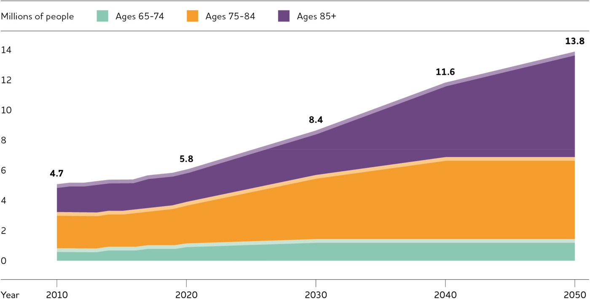
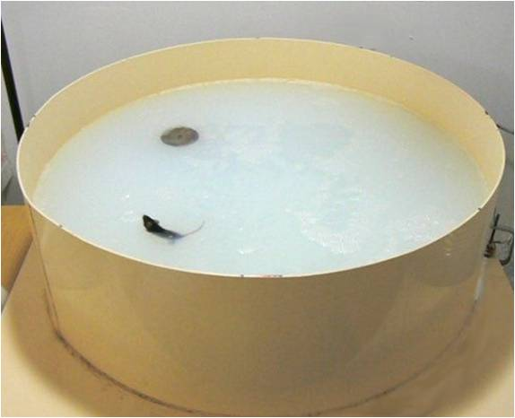
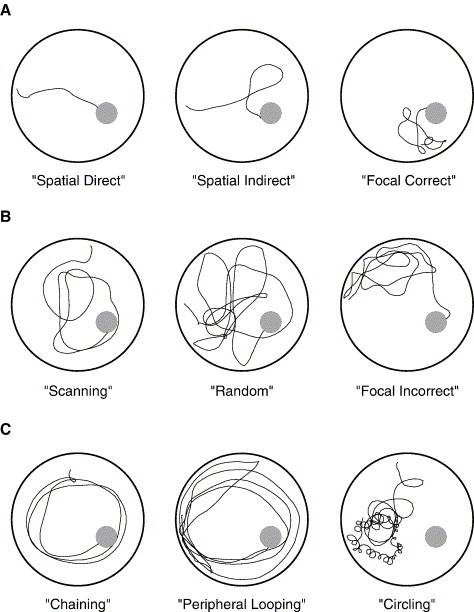
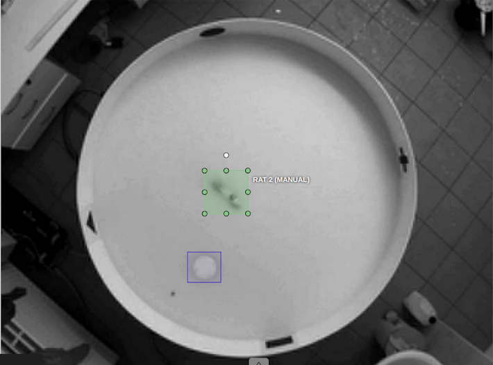
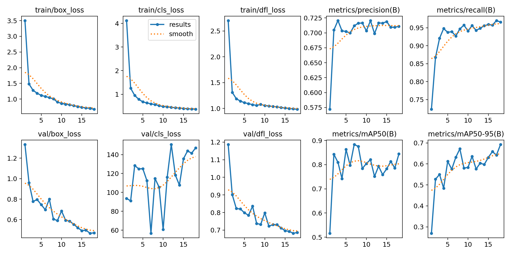
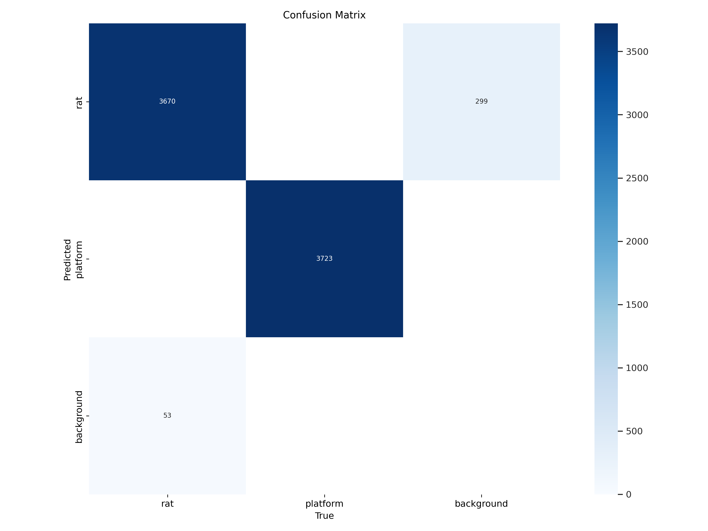
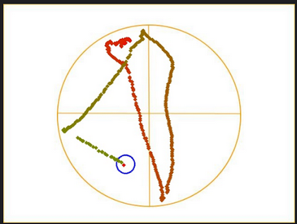

# Rat-Detection for Morris water maze clinical research
My project involved training an AI model where machine vision took center stage, as the goal was to recognize rats for clinical experiments.

# Alzheimer's Disease

Alzheimer's disease is a progressive neurodegenerative condition of the brain, gradually impairing nerve cells and brain functions. Its most characteristic symptoms include memory loss, cognitive decline, and emotional instability. Individuals with Alzheimer's typically lose their memory and ability for independent thinking, significantly impacting their daily lives and functioning. The disease is currently incurable, and treatment generally focuses on symptom management and improving quality of life. **Alois Alzheimer** first observed and documented it.


# Present Day

55 million people suffer from it, and this number is rapidly increasing.



New registered patients annually.
_https://alz-journals.onlinelibrary.wiley.com/doi/full/10.1002/alz.12068_


# Research

Richard G. Morris first proposed an experiment idea in 1981, where a rat is placed in a pool, deprived of most of its senses and has to find a platform submerged underwater. However, the water is opaque, so it cannot see underwater.



_https://scac-irib.univ-rouen.fr/en/tests/18/_

Morris named this experiment the **water maze**. During the experiment, they observed that patterns could be fitted to the routes taken by the rat.



_https://www.sciencedirect.com/science/article/abs/pii/S0014488605003547_

My project aims to provide a solution for generating this data.

# Implementation

## Data Collection

The videos need to be trimmed to the appropriate size. For this purpose, I wrote the following **Python script:**

```python
from moviepy.video.io.ffmpeg_tools import ffmpeg_extract_subclip
 
input_video_path = [INPUT_PATH]
output_video_path = [OUTPUT_PATH]
 
start_time = 1  # 0:01
end_time = 90    # 1:30

ffmpeg_extract_subclip(input_video_path, start_time, end_time, targetname=output_video_path)
print(f'Cut portion saved to {output_video_path}')
```

Following this, I annotated the images using the [CVAT](https://www.cvat.ai/) online tool. Since the free version does not include the download of video frames, I had to generate them using the following **Python script:**

```python
video_path = [INPUT_PATH]
output_directory = [OUTPUT_PATH]
 
cap = cv2.VideoCapture(video_path)
 
frame_count = 000000
 
while True:
    ret, frame = cap.read()

    if not ret:
        break

    frame_filename = os.path.join(output_directory, f'frame_00{frame_count:04d}.PNG')
    cv2.imwrite(frame_filename, frame)
    frame_count += 1

cap.release()
 
print(f'{frame_count} frames saved to {output_directory}')
```



This was followed by training the YOLOv8 model. The result was good, although the graph indicates a risk of overfitting in future developments.



However, the model works perfectly, as seen in the confusion matrix.



# Final result:


Also, a picture was prepared for pattern matching.



A simple GUI was developed for the application for easier file selection and management.


